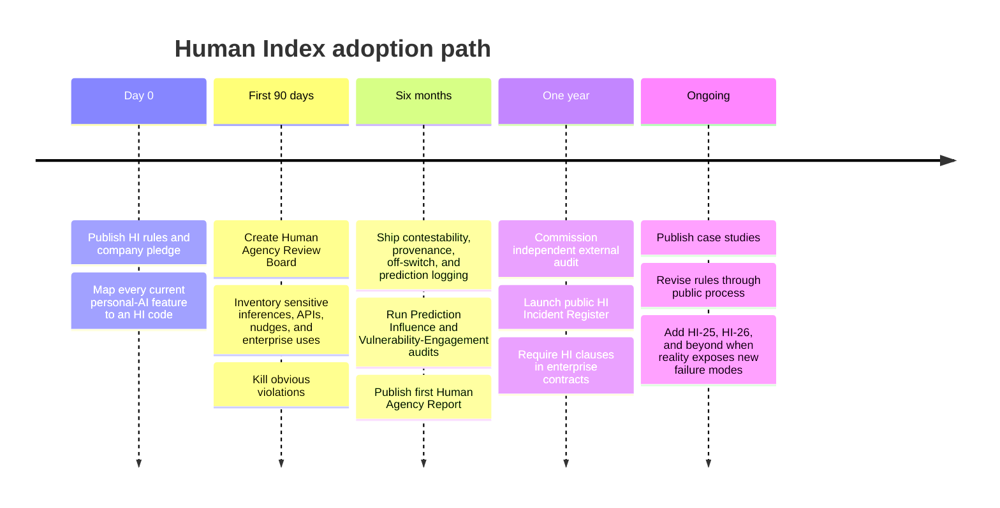

# Adoption

The Human Index is intended to travel beyond Still Cloud. Adoption should name a version, a defined product or system scope, and any public exceptions. It is a self-declaration, not certification by Still Cloud.

Suggested language:

> We have adopted Human Index 1.0.0-draft.1 for **[defined product or system]**. This is a self-declaration, not certification by Still Cloud.

## Adoption Path

A useful manifesto cannot remain one founder’s essay, one company’s internal doctrine, or another PDF passed around AI Twitter for three days. It needs a path from language to institutional muscle. The smartest pieces of existing frameworks point in the same direction: publish the values, attach them to actual decision procedures, test systems before and after deployment, create accountable governance, bring in outsiders, document incidents, and let the framework evolve in public. NIST’s RMF is explicitly lifecycle-oriented; IEEE 7000 is built around tracing ethical concerns into engineering; Anthropic treats public policy as an internal forcing function and now pairs risk reporting with planned external review; Google DeepMind uses standing councils; Partnership on AI uses real cases to refine a living framework.

The Human Index should be published under a permissive license so another company can take it without asking Still Cloud for permission, just as OpenAI’s Model Spec and Anthropic’s Constitution have been released for broad public use and adaptation. No company should be required to use Still Cloud’s exact wording. They should be required, socially and eventually perhaps contractually or regulatorily, to answer the underlying questions.

Did you build a score?

Did you make a prediction that changes the person it predicts?

Can the user tell your model it is wrong?

Can a child outgrow what your system thought about them at twelve?

Can an employer turn your personal model into a second résumé?

Can your growth team smell grief in the data?

Can someone shut the machine out of a part of their life?

Can they leave?

And after twenty years of watching them, remembering them, predicting them, and perhaps knowing patterns about them that nobody else on Earth can see, can your system still tolerate the most human answer possible?

**No. You don’t know what I’m going to do next.**

That is the line.

The point of personal AI should not be to construct a benevolent god that knows us so completely that disobeying it begins to feel irrational. It should not make life frictionless at the price of making life smaller. The goal is not to eliminate error from human beings until nobody gets to make an inexplicable decision again. We are supposed to build tools that give people more context, more memory, more understanding, more room to act—not machines that quietly transform a person’s past into the walls of their future.

So take the Index. Fork it. Tear apart the weak rules. Add better tests. Make HI-25 something we have not thought of yet. Put the codes into engineering tickets, board packets, investment diligence, model cards, enterprise contracts, procurement reviews, and regulatory drafts. Make “that violates HI-06” a sentence that can kill a nine-figure deal. Make “show me the HI-03 test” something an investor knows to ask before funding a company that predicts human behavior. Make the rules inconvenient enough to matter.

Because the question is no longer whether AI will know people.

It will.

The question is what we permit that knowledge to become.

## Forking and adaptation

Organizations may fork or adapt the framework under CC BY 4.0. If the rules are materially changed, the adapted framework should not be represented as an unmodified Human Index release. Preserve attribution and make differences visible.
