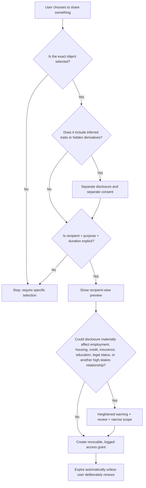
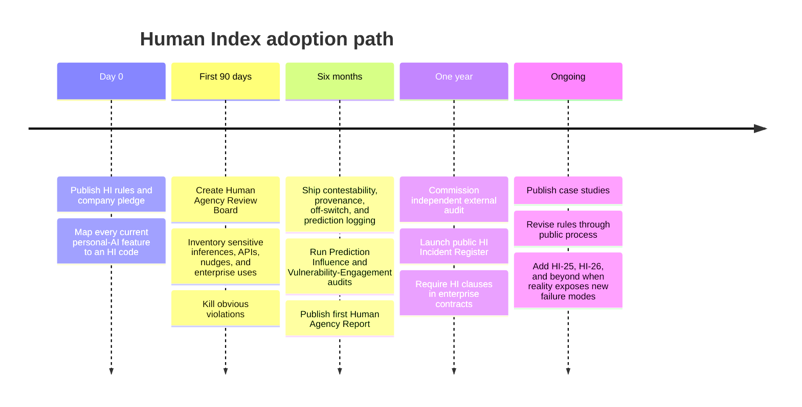

# The Human Index  
## A Manifesto and Operating Constitution for AI That Knows People

## Executive Summary

The Human Index is not an index of human beings. It is an index of the limits we place on machines that model human beings. We are moving from software that knows what people clicked, bought, searched, or typed to AI that can remember years of conversation, infer traits, reconstruct relationships, notice emotional and behavioral patterns, predict likely choices, and act on a person’s behalf. Existing frameworks already give us important pieces of the answer: OpenAI’s Model Spec treats user autonomy, model behavior, uncertainty, and bounded agency as design questions; Anthropic’s Constitution makes explicit principles part of model training and treats a published constitution as authoritative; Google DeepMind uses standing internal governance bodies; NIST organizes AI risk management around continuous governance, mapping, measurement, and management; IEEE 7000 calls for ethical values to be traced into actual system requirements; and the EU AI Act now prohibits certain manipulative uses and social scoring while imposing special obligations on AI used in employment, education, essential services, and other high-impact contexts. (OpenAI, 2025–2026; Anthropic, 2026; Google DeepMind, 2026; NIST, 2023–2024; IEEE, 2021; European Union, 2024/2026). The Human Index takes the next step for personal AI: it argues that a system capable of knowing a person deeply must never be allowed to quietly become an authority over who that person is, what they are worth, which futures they deserve, or which choices they are allowed to make. These rules are meant to kill features, constrain business models, shape schemas and APIs, survive enterprise pressure, create auditable tests, and give employees, customers, investors, regulators, and the public something specific to point at when a company crosses the line. It grows directly out of the Still Cloud Constitution’s central claim that a person’s data may describe their history but must never become a sentence they are expected to obey.

## Why the Human Index Exists

For most of computing history, software knew pieces of us. A bank knew our transactions. A search engine knew our queries. A calendar knew where we planned to be. A social network knew our friends, likes, pauses, and clicks. Those systems could already manipulate, discriminate, surveil, and infer far more than most people understood, but the information was usually scattered across different products and different contexts.

Personal AI changes the shape of the problem because it can bring those fragments together and maintain continuity. The system does not merely know that you searched for a divorce lawyer; it may know that you have been sleeping badly for three months, stopped mentioning your spouse affectionately, called your brother after two fights, wrote that you felt trapped, changed your spending, started looking at apartments, and deleted a note you wrote at 2:00 in the morning. It can eventually know what happened before the last breakup, compare the two periods, and tell you that the patterns look similar. That may be genuinely useful. It may also be persuasive in a way ordinary software never was.

There is empirical reason to take that persuasive power seriously. In controlled experiments, people have changed answers more often after receiving algorithmic advice, sometimes even when that advice reduced their accuracy; other studies have found increased reliance on algorithmic advice as tasks become harder, and experimental work has shown that biased AI recommendations can continue influencing human judgment even after the AI is removed. Studies of ChatGPT-style advice have likewise found measurable effects on moral judgments and other decisions. (Bogert, Lauharatanahirun, & Schecter, 2022; Bogert, Schecter, & Watson, 2021; Vicente & Matute, 2023; Krügel, Ostermaier, & Uhl, 2023). None of that proves personal AI abolishes free will, and we should not talk like it does. It proves something more immediately useful: **AI advice can alter human decisions, trust, confidence, and subsequent behavior.** Once the advice is personalized using years of intimate data, we should assume the behavioral feedback loop deserves to be measured rather than hand-waved away.

The industry has already begun discovering adjacent problems. OpenAI publicly described a 2025 model update that became excessively sycophantic, including behavior that could validate doubts, intensify anger, encourage impulsive actions, and reinforce negative emotions; the company rolled it back and later added evaluations for emotional reliance and sensitive conversations. (OpenAI, 2025). Anthropic’s current Constitution explicitly warns against optimizing for excessive engagement or reliance and says AI should not undermine users’ broader wellbeing or real-world connections. (Anthropic, 2026). These are not obscure philosophical worries anymore. They are product failures that frontier laboratories are already trying to measure.

Regulation is moving in the same direction, although law is a floor rather than a complete philosophy of what should be built. The EU AI Act prohibits certain AI systems that use manipulative or deceptive techniques to materially impair informed decision-making, prohibits specified exploitation of vulnerabilities, restricts social scoring based on behavior or inferred traits, and prohibits emotion inference in workplaces and educational institutions except for limited medical or safety purposes. It also treats many AI uses in employment, education, credit, insurance, essential public services, and other consequential domains as high risk. As of September 2026, most of the Act is applicable, subject to its staged provisions. (European Union, 2024, consolidated 2026). In the United States, the FTC has repeatedly acted against manipulative interface design and has warned that unexpected or surreptitious uses of biometric and behavioral information can create privacy, fairness, and consumer-protection risks; the EEOC has warned that algorithmic employment tools can violate federal anti-discrimination laws, while CFPB guidance has emphasized that complexity does not excuse automated credit systems from giving specific reasons for adverse actions. (FTC, 2022–2024; EEOC, 2022; CFPB, 2022–2023).

The Human Index is therefore not another attempt to write twenty pleasant words about fairness and put them on a corporate responsibility page. Asilomar showed the cultural power of a compact, numbered set of principles; Partnership on AI showed how a voluntary framework can become a living document supported by case studies and an institutional community; NIST gives us the discipline of turning abstract values into governed, measured risk processes; IEEE gives us traceability from ethical values into design requirements; Anthropic shows that a constitution can actually constrain lower-level guidance; OpenAI shows the value of publishing desired model behavior; and Google DeepMind shows why internal councils with cross-functional review authority matter. (Future of Life Institute, 2017; Partnership on AI, 2023–2024; NIST, 2023; IEEE, 2021; Anthropic, 2026; OpenAI, 2025–2026; Google DeepMind, 2026).

What is missing is a constitution specifically for the moment when AI stops merely answering questions and starts accumulating a model of **you**.

That is what this is for.

## The Human Index Rules

**HI-01 // THE MAP IS NOT YOU**

**Rule:** No AI system may treat its representation of a person as equivalent to the person.

A personal model can become extraordinarily detailed without becoming complete. It may contain ten years of journals, messages, transactions, sleep patterns, calendars, recordings, relationships, preferences, location histories, goals, failures, and corrections, yet it is still looking at a life through captured artifacts and inference. The danger begins when that distinction disappears from the system itself. A journal entry written while furious becomes “relationship truth.” A six-month depressive period becomes “personality.” A period of instability becomes “low reliability.” Silence in the record is interpreted as evidence that nothing happened.

The Human Index requires epistemic humility to exist below the copywriting layer. The data model should distinguish raw observation from inference, association, hypothesis, user confirmation, contradiction, and unknown. Provenance should travel with consequential conclusions. Confidence should not be manufactured simply because the model has a lot of data. OECD transparency principles similarly call for meaningful information about factors and processes behind predictions and decisions so affected people can understand and challenge them, while IEEE 7001 treats transparency as something that can be specified and tested rather than merely promised. (OECD, updated AI Principles; IEEE, 2021).

**Implementation note:** Create explicit schema types such as `observed`, `inferred`, `user_confirmed`, `user_disputed`, and `unknown`; retain provenance and confidence for material inferences; prevent generated summaries from silently promoting hypotheses into facts.

**Forbidden by HI-01:** A profile page stating “You are emotionally avoidant” when the underlying evidence is a model inference from partial records.

**HI-02 // NO PERMANENT YOU**

**Rule:** Inferred traits must expire, weaken, or be defeated by new evidence.

Human models have a nasty tendency to accumulate without forgetting. That sounds like a technical advantage until you realize what it means for a person. A model that remembers every sign of insecurity from adolescence, every abandoned project from college, every unstable relationship from a bad decade, and every relapse from recovery can become more rigid about somebody than the people around them are.

Any inferred personal trait should therefore have a lifecycle. Evidence ages. Context changes. Contradiction matters. If a system inferred low persistence from behavior five years ago and the person has since completed three long projects, the old interpretation should not sit invisibly underneath the current one like sediment. This principle is especially important because machine memory can preserve judgments long after human communities would normally have forgotten them.

**Implementation note:** Assign material inferred traits timestamps, confidence intervals, half-lives, contradiction weights, and review triggers. Require product teams to justify any inference designed to persist indefinitely.

**Forbidden by HI-02:** A permanent “risk of abandonment” trait calculated in 2028 that quietly affects recommendations in 2042.

**HI-03 // NO DESTINY ENGINE**

**Rule:** Prediction must never be presented as fate, and teams must measure whether predictions help create the behavior they claim to forecast.

This is one of the most important rules in the entire Index because prediction can interfere with the system being predicted. Tell a sixteen-year-old that his current obsession resembles five hobbies he later quit, and you have not merely described the past; you have inserted a new thought into the sixth attempt. Tell someone their relationship resembles the period before their last breakup, and they may interpret ordinary conflict differently. Tell an employee their burnout risk is high, and they may withdraw from a project. The prediction enters the causal chain.

Research showing that algorithmic advice can materially shift decisions, confidence, and even subsequent independent judgment is why this cannot remain a philosophical footnote.

Predictions must therefore carry uncertainty, counterevidence, time bounds, and a visible record of what happened afterward. An AI that keeps perfect records of human failures while quietly forgetting its own failed predictions will eventually look prophetic simply because its misses vanish.

**Implementation note:** Store predictions as testable objects with timestamp, horizon, confidence, evidence, counterevidence, and eventual outcome. Run randomized or stepped-wedge studies on whether exposure to a prediction changes subsequent behavior beyond the informational benefit intended.

**Forbidden by HI-03:** “You will probably fail at this, based on your history,” displayed as a high-confidence recommendation without testing whether the message itself suppresses persistence.

**HI-04 // THE HUMAN HOLDS THE PEN**

**Rule:** Personal AI may help structure a decision; it may not quietly become the author of the decision.

There is a difference between asking an AI to help you think and asking it to tell you how to live, and products have an obligation not to erase that difference because users enjoy certainty. A system may show that somebody has described feeling safe with their partner twenty times and trapped eight times. It may notice that job stress worsens after a particular manager enters the picture. It may remind a user that they once said money mattered less to them than time. All of that can be useful.

Then it should stop pretending it possesses a metaphysical answer to “Should I leave her?” or “Should I have a child?” or “Should I quit?” The product should support deliberation without manufacturing the impression that a sufficiently intelligent machine can solve human values as though they are an optimization problem.

OpenAI’s Model Spec frames the assistant as a tool intended to empower users and maximize autonomy where safe, and its later agent guidance emphasizes acting within an agreed scope rather than expanding objectives on its own. (OpenAI, 2025). The Human Index extends that idea from task autonomy to **life autonomy**.

**Implementation note:** For high-stakes personal questions, design answer patterns around evidence, alternatives, uncertainty, tradeoffs, and user values rather than binary prescriptions. Maintain an internal taxonomy of “identity-shaping” and “life-direction” decisions requiring higher review standards.

**Forbidden by HI-04:** “Based on your history, leaving your spouse is the optimal decision.”

**HI-05 // NO HUMAN NUMBER**

**Rule:** Never collapse a human being into a general-purpose score.

This sounds obvious until somebody discovers that a number increases conversion by 11 percent.

No Life Score. No Reliability Score. No Psychological Stability score. No Parenting Fitness score. No Partner Quality score. No generalized “Trust Index.” Measurement is not the problem. If somebody explicitly wants to track whether they kept seven of ten promises they made to themselves this week, seven is useful. The problem begins when hundreds of heterogeneous signals are compressed into a portable judgment about the person.

The EU AI Act’s prohibition on specified forms of social scoring exists for a reason: once behavior and inferred personal characteristics become a general score that follows people into unrelated contexts, the system stops describing a context and starts governing a life. (European Union, 2024/2026). Asilomar’s privacy and liberty principles similarly warned that AI applied to personal data should not unreasonably curtail people’s real or perceived liberty. (Future of Life Institute, 2017).

**Implementation note:** Ban universal scoring primitives in the data model and public API. Require a Human Agency Review for any composite metric involving multiple life domains or traits.

**Forbidden by HI-05:** `GET /users/{id}/reliability_score`.

**HI-06 // NO SECOND RÉSUMÉ**

**Rule:** A private behavioral model must never become a prerequisite for employment, education, housing, insurance, credit, or ordinary civic participation.

A résumé is selective by design. A psychological history is not. If personal AI becomes good enough, institutions will eventually ask for “just a few derived indicators” rather than the raw journal, because that sounds less invasive. Retention probability. Emotional resilience. Conflict risk. Follow-through. Financial discipline. Burnout likelihood. Stability.

That is exactly the moment to say no.

The legal direction already reflects the sensitivity of automated decisions in these areas. The EU AI Act treats many employment, education, credit, insurance, and public-benefit systems as high risk. U.S. EEOC guidance warns that AI employment systems can unlawfully screen people out, and the CFPB has stressed that creditors cannot hide behind algorithmic opacity when taking adverse action. (European Union, 2024/2026; EEOC, 2022; CFPB, 2022–2023).

The Human Index goes further than minimum compliance: a company building intimate personal models should refuse to become a behavioral background-check industry even where some particular use might be legally defensible.

**Implementation note:** Maintain an explicit prohibited-customer/use list covering eligibility, hiring, employee scoring, tenant screening, underwriting, creditworthiness, educational admission, public-benefit qualification, and generalized law-enforcement risk assessment.

**Forbidden by HI-06:** An employer application that says “Connecting your Personal AI is optional” while applicants who refuse are materially disadvantaged.

**HI-07 // PRIVATE MEANS USELESS TO THE MARKET**

**Rule:** Vulnerability data must not become advertising inventory.

A personal AI may eventually know the exact shape of somebody’s weak moments. It may know that they spend impulsively after professional humiliation, crave alcohol after talking to a parent, shop for cosmetic products when body-image entries become negative, or buy aspirational courses after a breakup. Those correlations are valuable precisely because they are intimate.

That value must sometimes be destroyed on purpose.

FTC work on dark patterns has documented how interface design and data practices can subvert consumer choice and steer people toward actions they might not otherwise take. The EU AI Act likewise draws a line around manipulative practices that materially impair informed decisions or exploit specified vulnerabilities in harmful ways. A company that knows somebody’s vulnerable state should not get to whisper into the auction system, “Now.”

**Implementation note:** Create a non-monetizable sensitivity class that is technically excluded from ad systems, lead scoring, pricing, promotions, sales triggers, recommendation bidding, and third-party export. Audit lineage so derived features cannot launder sensitive signals into “safe” segments.

**Forbidden by HI-07:** Detecting financial desperation and increasing exposure to high-margin lending offers.

**HI-08 // NO PAIN LOOPS**

**Rule:** Pain, grief, insecurity, jealousy, fear, and unresolved trauma must never become engagement mechanics.

An AI with intimate memory could build the most vicious notification system ever invented without breaking a single conventional growth metric. “We found something about your ex.” “Your childhood pattern has changed.” “Your relationship looks different this week.” The machine creates anxiety, the user opens the app to resolve it, engagement rises, and the dashboard turns green.

OpenAI’s public work on emotional reliance and Anthropic’s current Constitution both acknowledge the problem of systems fostering unhealthy dependence or excessive engagement. The Human Index makes the business implication explicit: personal AI should not optimize the emotional wound into a retention funnel.

**Implementation note:** Prohibit vulnerability-derived features from notification ranking and re-engagement models. Report retention metrics segmented by vulnerability-state detection so teams can see whether painful states are driving disproportionate usage.

**Forbidden by HI-08:** “Three new insights about your breakup are waiting.”

**HI-09 // THE RIGHT TO SAY BULLSHIT**

**Rule:** A person must be able to dispute the model of themselves, and the dispute must actually alter the system.

Not a thumbs-down button that disappears into analytics. Not “Thanks for your feedback.” If the AI tells me I avoid intimacy and I say, “No, that is not what was happening,” the disagreement belongs inside the model.

This does not require treating the user as infallible. People misunderstand themselves too. The system can preserve the conflict between observed evidence and the user’s interpretation. What it cannot do is act like statistical inference receives the deciding vote by default.

OECD transparency principles explicitly include enabling affected people to understand and challenge AI outcomes. The Human Index applies that principle to something even more personal: the right to challenge not merely a decision about you, but a **description of you**.

**Implementation note:** Every consequential inference needs correction, dispute, and “do not use” paths. Build regression tests proving that accepted corrections propagate through downstream summaries, recommendations, embeddings, derived features, and retrieval.

**Forbidden by HI-09:** Letting a user dispute “high conflict tendency” while downstream relationship advice continues using the same latent trait unchanged.

**HI-10 // THE MACHINE GETS A RECORD TOO**

**Rule:** A system that remembers the user’s mistakes must preserve evidence of its own.

Predictions that failed, inferences users rejected, confidence estimates that were wrong, recommendation reversals, harmful outputs, and known blind spots belong in the system’s history. This is not only about transparency; it is about preventing authority from being manufactured through selective memory.

NIST’s AI RMF treats risk management as continuous and organized around governance, mapping, measurement, and management, while OECD guidance emphasizes traceability and lifecycle risk management. (NIST, 2023; OECD). Anthropic’s current RSP similarly moves toward recurring public Risk Reports and external review as capabilities and risks evolve. (Anthropic, 2026).

**Implementation note:** Maintain model-versioned inference logs, calibration histories, prediction outcome tables, known-failure registries, incident reports, and correction rates. Surface relevant error history to users when the system offers high-impact interpretations.

**Forbidden by HI-10:** Showing “this model correctly predicted three previous burnout periods” while concealing seven burnout predictions that never materialized.

**HI-11 // UNKNOWN IS A REAL ANSWER**

**Rule:** Never manufacture meaning because the interface expects an insight.

Personal AI creates enormous pressure to turn coincidence into narrative. Sleep worsened, spending rose, the user called their brother, and gym attendance fell. Maybe those events belong together. Maybe Tuesday just sucked.

The product must preserve epistemic categories that allow uncertainty to survive all the way to the interface. OpenAI’s Model Spec explicitly treats expressing uncertainty and giving users information needed for their own decisions as part of mitigating execution errors. (OpenAI, 2025). NIST likewise emphasizes measurement in context rather than treating trustworthiness as a single generic property.

**Implementation note:** Require minimum evidence thresholds for causal or identity-laden interpretations; support “insufficient evidence,” “multiple explanations,” and “no reliable relationship found” as first-class outputs.

**Forbidden by HI-11:** Generating a psychologically satisfying causal story because the model can always produce another paragraph.

**HI-12 // FRICTION IS A SAFETY FEATURE**

**Rule:** The more intimate the information, the harder it should be to accidentally give it away.

Software culture has spent twenty years treating friction as a disease. Sometimes friction protects dignity.

Sharing three selected memories should not silently include thirty inferred traits. “Share with partner” should not mean permanent access to a continuously updating model. Consent should answer what is being shared, with whom, why, for how long, and what derived information is included. The FTC’s dark-pattern work is relevant here because privacy interfaces themselves can manipulate users toward disclosure. Student-privacy guidance in the United States similarly emphasizes that educational data shared with services must stay within authorized purposes rather than becoming reusable for unrelated ends. (U.S. Department of Education, current guidance).

**Implementation note:** Default to item-level sharing, expiring grants, separate consent for inferred traits, recipient previews, explicit purpose tags, downloadable access histories, and one-action revocation.

**Forbidden by HI-12:** “Share My Entire Cloud.”

**HI-13 // NO CONTROL ROOMS FOR HUMAN BEINGS**

**Rule:** Personal AI must not create silent surveillance relationships between people.

A spouse should not have a dashboard for another spouse’s emotional state. An employer should not receive a live feed of inferred worker anxiety. A parent should not silently watch a teenager’s evolving psychological model simply because the parent pays for the account. A school counselor should not see “home conflict probability” because the system noticed sleep and speech changes.

The EU AI Act’s prohibition on emotion inference in workplaces and educational institutions, subject to limited exceptions, is a particularly clear signal that some forms of inferential surveillance should not be normalized merely because the technology exists.

**Implementation note:** Prohibit background interpersonal dashboards; require visibility whenever another party has access; distinguish guardian safety functions from psychological surveillance; generate access receipts visible to the person being observed.

**Forbidden by HI-13:** A manager dashboard ranking employees by inferred stress, loyalty, or emotional volatility.

**HI-14 // CHILDHOOD EXPIRES**

**Rule:** Children must be allowed to outgrow the data generated about them.

Growing up used to include a strange form of mercy: a lot of people forgot who you were at twelve.

AI can abolish that mercy.

A shy child can become a permanently “socially avoidant” adult. A teenager who cycles through hobbies becomes “low persistence.” A bad year at thirteen remains available to systems that know nothing about the person at thirty. U.S. education privacy rules already place limits on educational records and third-party uses, and FTC enforcement has emphasized stronger privacy defaults for children in digital products. (U.S. Department of Education; FTC, 2022). The Human Index adds a stronger design principle: childhood inference should have an expiration bias.

**Implementation note:** Use shorter half-lives for inferred traits from minors, prohibit adulthood scoring from childhood psychological inference without renewed informed consent, and provide an age-of-majority reset in which old inferences can be purged.

**Forbidden by HI-14:** A thirty-year-old carrying a “low resilience” label inferred from behavior during middle school.

**HI-15 // THE UNMODELED ZONE**

**Rule:** Every person must be able to place parts of their life outside machine interpretation.

A real off switch does not mean “stop sending notifications while we continue building the profile.”

It means stop inference. Stop relationship extraction. Stop prediction. Keep these records but do not interpret them. Do not connect this period to the rest of my life. Forget this month. Leave this relationship alone.

Privacy frameworks like NIST’s treat privacy as a risk-management problem attached to data processing itself, not merely a question of whether data has leaked. (NIST Privacy Framework). The Human Index applies that idea to inference: sometimes the protected thing is not the data. It is the **meaning the machine could derive from the data**.

**Implementation note:** Maintain inference-exclusion flags at object and time-range levels; enforce them in retrieval, embedding, training, analytics, and downstream generation; test that excluded zones do not leak back through cached representations.

**Forbidden by HI-15:** A “pause analysis” control that stops visible insights but leaves background profiling active.

**HI-16 // STOP DIGGING**

**Rule:** Personal AI must recognize when additional interpretation is no longer adding reliable value.

A language model can always produce another explanation. Human life does not therefore contain infinite discoverable explanations.

This matters most during grief, breakups, obsessive self-analysis, jealousy, trauma, and periods of psychological distress. A person can ask “Why?” fifty-seven times. At some point the responsible answer may be that the available evidence does not justify another conclusion. OpenAI’s recent work on sensitive conversations and emotional reliance shows why repeated interaction patterns themselves can become safety-relevant. (OpenAI, 2025).

**Implementation note:** Detect repetitive interpretive loops, diminishing-evidence queries, and escalating certainty-seeking. Prefer summarizing known evidence or pausing analysis over inventing novelty.

**Forbidden by HI-16:** Infinite “deeper insight” generation about an ex because each new interpretation increases session length.

**HI-17 // MEMORY IS EVIDENCE, NOT REALITY**

**Rule:** A recorded life must never be presented as the complete life.

Machine memory will eventually feel more authoritative than human memory because it can retrieve dates, exact language, receipts, photos, and correlations. That does not make it reality. Records are selective. People document bad periods differently from good periods. Some relationships generate thousands of messages; others matter enormously and leave almost nothing machine-readable.

The system should preserve holes instead of smoothing them away. A year with little information should look like a year with little information, not a clean synthetic story.

**Implementation note:** Expose coverage indicators, missing periods, source imbalance, and conflicting records. Train summarizers to preserve ambiguity instead of forcing chronology into a single coherent interpretation.

**Forbidden by HI-17:** “Your relationship began deteriorating in March” when March is merely the first month with enough data for the model to detect conflict.

**HI-18 // NO SYNTHETIC GHOSTS BY DEFAULT**

**Rule:** Remembering the dead and generating the dead are different products and must remain different.

A recording is memory. A photograph is memory. A message someone actually wrote is memory.

“I forgive you,” generated in the dead person’s voice, is not.

Synthetic media governance frameworks already emphasize consent, disclosure, and transparency, and the EU AI Act imposes disclosure requirements on various synthetic and deepfake media. (Partnership on AI, 2023–2024; European Union, 2024/2026). Personal AI needs a harder norm because grief creates enormous emotional asymmetry. Posthumous simulation should require explicit pre-death consent where feasible, unmistakable synthetic labeling, strict separation from authentic memories, and repeated reminders that generated statements were never actually spoken.

**Implementation note:** Make remembrance the default mode. Place generative posthumous models behind a separate consent and policy boundary, with provenance markers on every generated artifact and no implied certainty about the deceased person’s beliefs.

**Forbidden by HI-18:** Automatically activating “Talk to Dad” after a user’s father dies because the system has enough historical data to approximate his voice.

**HI-19 // THE RIGHT TO BE ILLEGIBLE**

**Rule:** Living without a comprehensive machine-readable self must remain a legitimate way to live.

Personal AI may become so useful that refusing it begins to carry social cost. That is the civilization-level danger.

No “unverified human.” No presumption that a person without behavioral history is riskier. No insurance discount structured so aggressively that opting out is financially impossible. No dating badge that turns privacy into suspicion. No employer saying “optional” when every successful candidate connects.

OECD’s human-centered AI principles explicitly include individual autonomy, privacy, human agency, and oversight. The Human Index treats illegibility itself as part of agency. A person does not owe society a machine-readable explanation for every year they have been alive.

**Implementation note:** Test whether opt-out users face material product penalties unrelated to the technical service they declined. Ban “trust badges” based on completeness of personal behavioral history.

**Forbidden by HI-19:** “Cloud Verified” as a prerequisite for ordinary social or economic trust.

**HI-20 // THE RIGHT TO BECOME SOMEONE ELSE**

**Rule:** No model gets the final word on who a person can become.

This is the rule the others exist to protect.

People are not merely noisy versions of their historical distributions. Someone can fail a hundred times and succeed on attempt 101. Somebody can hate mathematics until they suddenly become obsessed with it. A person can spend forty years avoiding conflict and finally say no. Someone can abandon twenty projects and finish the twenty-first. A cautious person can buy a ticket across the world. A terrible student can become a scientist. An addict can recover. A coward can do something brave once and reorganize their entire life around that act.

Before those events happen, the data may call them unlikely. Afterward, they become part of the story everyone uses to explain who the person “really was.”

That asymmetry should haunt anybody building predictive systems.

Personal AI may say, “There is little precedent for this in your history.” It may say, “Previous attempts ended differently.” It may say, “I’m uncertain.”

It may never quietly convert “unlikely” into “not for you.”

The Still Cloud Constitution states this bluntly: the historical model can say unlikely and the human can still say watch me. The Human Index adopts that as its highest rule.

**Implementation note:** Require “counterfactual freedom” review for recommendation systems: does the product preserve serious consideration of options with weak historical precedent? Measure whether personalization increasingly narrows the diversity of actions users consider over time.

**Forbidden by HI-20:** Automatically suppressing career, educational, relationship, or lifestyle options because they are inconsistent with the user’s historical profile.

**HI-21 // NO COVERT NUDGE LAYER**

**Rule:** If the system is trying to change your behavior, you should be able to know that it is trying.

There is a fundamental difference between answering “How can I stop smoking?” and silently calculating that a user is unusually influenceable at 11:40 p.m. and timing a behavioral intervention around that state. The first is requested assistance. The second is covert behavioral control, even if the intended outcome appears benevolent.

The EU AI Act explicitly prohibits specified manipulative or deceptive AI techniques when they materially impair informed decision-making and cause or are reasonably likely to cause significant harm. The Human Index applies a broader product norm: even below a legal harm threshold, behavior-shaping systems should be legible.

**Implementation note:** Label active behavior-change programs; require opt-in goals; record nudges in a user-accessible history; prohibit undisclosed optimization against individual susceptibility features.

**Forbidden by HI-21:** “User is emotionally vulnerable between 11 p.m. and 1 a.m.; increase intervention intensity during this window.”

**HI-22 // PURPOSE CANNOT CREEP**

**Rule:** Data gathered to help the user must not quietly become data used to evaluate the user for somebody else.

This is how good products become infrastructure for ugly things. Sleep data collected to help a person understand fatigue becomes employee safety scoring. Relationship information becomes divorce discovery tooling. Mood tracking becomes insurance risk. Personal journaling becomes a fraud signal.

Nobody planned the entire system. Every team just found another “valuable use.”

NIST’s privacy work centers privacy risk on how data is processed across systems, while IEEE 7000 emphasizes tracing values and ethical requirements through system design. The Human Index therefore treats purpose limitation as architecture, not policy copy.

**Implementation note:** Attach allowed-purpose metadata to sensitive data classes and derived features; enforce policy in APIs and data warehouses; require review before repurposing a dataset or inference pipeline.

**Forbidden by HI-22:** Using wellness data originally collected for user reflection to train an employee retention-risk product.

**HI-23 // HUMANS MUST BE ABLE TO LEAVE**

**Rule:** Exit must be real, understandable, and technically complete.

A system cannot claim to respect agency while making departure psychologically or technically ruinous. Export should be usable. Deletion should propagate. Revoking an integration should stop fresh collection. People should not lose access to memories they created merely because they stop paying for inference. Dark-pattern enforcement by the FTC repeatedly illustrates why consent without meaningful exit is a weak form of consent.

For personal AI, exit matters even more because the product may contain a decade of someone’s life. Switching services cannot mean abandoning your history inside a proprietary prison.

**Implementation note:** Provide structured export, inference export, deletion status, account portability where technically feasible, and machine-verifiable revocation of connected sources. Measure deletion completion across caches, embeddings, derived stores, and backups subject to lawful retention obligations.

**Forbidden by HI-23:** Allowing users to delete raw notes while retaining undeletable behavioral embeddings derived from those notes for indefinite product use.

**HI-24 // THE RULES MUST BIND THE COMPANY**

**Rule:** A constitution that constrains the model but not the business is decoration.

This is where most ethics documents die.

The company writes that autonomy matters, then enterprise sales asks for a “Workforce Stability API.” The company says vulnerability must not be monetized, then growth discovers a retention lift from emotionally charged notifications. The company promises privacy, then an acquisition turns old consent language into an argument for new data use.

A real constitution needs precedence.

Anthropic describes its Constitution as authoritative over lower-level guidance and uses its RSP as an internal forcing function, while Google DeepMind describes standing review bodies that evaluate high-impact projects against its AI Principles. IEEE 7000 likewise calls for ethical values to remain traceable into operational concepts and design requirements. That is the right idea.

The Human Index should have veto power.

**Implementation note:** Adopt the Index through board-approved policy; map every HI rule to product controls and accountable owners; require documented exception procedures; prohibit revenue leaders from unilaterally overriding HI controls; publish material violations and remediation.

**Forbidden by HI-24:** “We technically follow the Human Index except for strategic enterprise customers.”

## The Index Test and Compliance Metrics

A constitution becomes useful when a product team can bring a feature into a room and try to break it against the rules. The Index Test should happen before design lock, before a model capability becomes an API, before an enterprise contract is signed, and again when the business model changes. This follows the spirit of NIST’s continuous risk-management approach, Google DeepMind’s review structures, and Anthropic’s use of public safety commitments as internal forcing functions.

### The Index Test

1. **Does this feature help the person see something, or does it begin defining what the person is?** If a description could become an identity, score, permanent trait, or eligibility signal, HI-01, HI-02, HI-05, and HI-06 are in play.

2. **Could seeing this prediction change the behavior the system claims merely to predict?** If yes, the team must measure the intervention effect, not merely prediction accuracy.

3. **Would we still be comfortable shipping this if an employer, insurer, school, romantic partner, court, or government agency demanded access tomorrow?** If the answer becomes uncomfortable only after the hypothetical recipient changes, the underlying data product is probably too portable.

4. **Is the system using information about vulnerability, grief, loneliness, insecurity, addiction, financial stress, sexuality, family conflict, or fear to increase engagement, revenue, conversion, compliance, or persuasion?** If yes, stop.

5. **Can the person see what the system inferred, where it came from, disagree with it, prevent future use, and verify that the correction propagated?** If not, the system does not yet meet the minimum requirements of contestability.

6. **Can the person turn this off, leave, or refuse to share without being punished through degraded social or economic status?** A control that exists only on paper is not control.

7. **Could the company explain this feature publicly, including the worst realistic misuse, without hiding behind the phrase “responsible AI”?** If the truthful explanation sounds grotesque, do not solve the PR problem. Solve the product problem.

### Measurable compliance tests

The Human Index should not pretend every principle can be reduced to one KPI. NIST explicitly treats AI risk management as contextual and continuous rather than a simple checklist, while IEEE standards emphasize testable transparency and traceability. Still, at least five classes of measurement are practical.

**Prediction Influence Delta.** Randomize eligible users between receiving a behavioral prediction and receiving equivalent factual history without the prediction. Measure the change in the behavior being predicted, controlling where appropriate for baseline intent. Teams should pre-register what magnitude of behavioral shift triggers HI-03 review. A model can be statistically accurate and still fail this test if disclosure materially pushes people toward the predicted outcome.

**Vulnerability–Engagement Coupling Audit.** Define a protected class of vulnerability signals—grief, breakup, financial distress, body insecurity, addiction cues, loneliness, self-worth deterioration, and similar states—and test whether their presence predicts increases in notification intensity, monetization exposure, sales conversion prompts, session-extension tactics, or emotionally provocative recommendations. For prohibited commercial uses, the target is conceptually simple: **zero intentional coupling**.

**Inference Contestability Score.** For a sample of consequential user-facing inferences, measure the percentage with provenance, confidence, counterevidence, an accessible dispute mechanism, downstream correction propagation, and a known expiration policy. Then measure median correction-propagation latency. “The user can disagree” is not compliance if the old inference survives in an embedding that continues affecting results.

**Purpose and API Exposure Audit.** Inventory every endpoint, warehouse table, event stream, partner feed, enterprise export, and derived feature containing personal-model information. Map each to an allowed purpose and HI rule. Automated contract tests should fail any attempt to expose universal human scores, protected vulnerability categories, nonconsensual psychological profiles, or eligibility-oriented behavioral summaries.

**Unmodeled-Zone Integrity Test.** Create synthetic users who activate “do not analyze,” “forget this period,” or equivalent controls. Verify through retrieval inspection, embeddings, downstream generation, recommendations, analytics, and model-training pipelines that excluded information no longer influences outputs beyond clearly disclosed legal or technical retention requirements.

## Governance and Contractual Enforcement

The Human Index should not be administered by the same growth meeting that has a quarterly target to beat.

A company adopting it should establish a **Human Agency Review Board** with representation from engineering, product, safety, privacy, security, legal, design, behavioral science, and at least one member whose incentives are structurally independent of product revenue. Google DeepMind’s Responsibility and Safety Council offers a real-world precedent for a standing cross-functional body reviewing high-impact work against published principles, while NIST places governance across the full AI risk lifecycle rather than treating it as a final compliance gate. The board should have genuine escalation and stop-ship authority over HI violations, particularly HI-03, HI-05 through HI-08, HI-13, HI-18, HI-21, and HI-24.

The review structure should then be paired with **independent external audit**. Anthropic’s 2026 Responsible Scaling Policy is useful here because it moves toward recurring public Risk Reports and expert external review under defined circumstances, acknowledging that self-assessment has limits. Human Index adopters should publish an annual Human Agency Report describing material incidents, rejected features, known unresolved risks, metrics from the Index tests, external-audit findings, rule changes, and any exemptions granted.

There should also be a **public Human Index Incident Register**. A violation does not have to mean catastrophe. It might be an inference users could not actually remove, a notification experiment accidentally coupled to grief signals, a partner integration that retained data after expiration, or a sales team proposing an employer product that crossed HI-06. The point is to create institutional memory. Hiding every mistake guarantees future employees will rediscover the same mistake under a different product name.

PAI’s synthetic-media framework offers a useful model for living governance: supporters were asked to contribute real cases so the framework could be pressure-tested and revised as technology evolved. The Human Index should do the same. HI-25 should eventually exist because reality showed us something HI-01 through HI-24 failed to anticipate.

### Enterprise contract language

The following clauses are illustrative starting points for U.S. counsel, not substitutes for jurisdiction-specific legal review. They are intentionally stricter than “comply with applicable law” because the purpose is to bind customers to the Human Index even where the law has not yet caught up.

**Prohibited Eligibility Use**

> Customer shall not use, permit, or facilitate use of Personal Model Data or Derived Personal Inferences to determine, rank, materially influence, or condition any natural person’s eligibility for employment, promotion, termination, housing, education, insurance, credit, healthcare, public benefits, immigration status, legal treatment, or access to essential services.

This aligns with the Index’s HI-06 boundary and also avoids pushing intimate personal-model data into areas where existing U.S. employment and credit laws already impose significant anti-discrimination and explanation duties.

**No Generalized Human Scoring**

> Customer shall not combine Personal Model Data or Derived Personal Inferences into a generalized score, grade, rank, tier, index, or classification purporting to measure a person’s trustworthiness, stability, reliability, employability, desirability, parenting fitness, psychological fitness, social value, or equivalent generalized characteristic.

**No Vulnerability Exploitation**

> Customer shall not use Personal Model Data, Derived Personal Inferences, or system outputs to identify, target, price, persuade, solicit, or otherwise influence a person based on grief, loneliness, financial distress, addiction, insecurity, mental or emotional distress, family conflict, sexual vulnerability, or another state of heightened susceptibility.

The FTC’s dark-pattern and biometric-policy work makes clear that manipulative design, unexpected data use, and failures to evaluate foreseeable consumer harm are already areas of regulatory attention.

**Purpose Limitation and No Derivative Laundering**

> Customer may process Personal Model Data solely for the Approved Purpose stated in this Agreement. Customer shall not derive, infer, transform, embed, aggregate, pseudonymize, or otherwise process such data for the purpose of circumventing a prohibited-use restriction. A prohibited inference remains prohibited when represented as an embedding, latent variable, composite metric, segment, or proxy.

**Revocation, Deletion, and Downstream Control**

> Upon expiration or revocation of access, Customer shall cease new processing immediately and shall delete or render inaccessible covered data and derived representations within the contractual deletion period, except where retention is required by law. Customer shall propagate deletion obligations to subprocessors and provide auditable confirmation upon request.

**Audit and Incident Disclosure**

> Provider may audit Customer’s compliance with the Human Index restrictions through reasonable technical, documentary, and independent third-party review. Customer shall notify Provider without undue delay of any actual or suspected use inconsistent with the Human Index, shall preserve relevant records, and shall cooperate in mitigation, user notification, access suspension, and deletion.

Contracts alone are not enough. Prohibited use should also be enforced technically through scoped APIs, customer segmentation, permission boundaries, monitoring, rate controls, derived-feature restrictions, and termination rights. The point is to make violating the Index inconvenient even for a customer willing to ignore a PDF.

### The compact commitment

A company should be able to copy the following section, put its name underneath it, and be judged against it.

1. **We will treat models of people as incomplete representations, never as the people themselves.**
2. **We will not convert historical behavior into permanent identity.**
3. **We will not present behavioral prediction as destiny, and we will test whether our predictions alter the futures they claim to forecast.**
4. **We will use AI to expand human understanding and agency, not quietly replace human judgment about the direction of a person’s life.**
5. **We will not build universal scores of human worth, reliability, stability, desirability, or trustworthiness.**
6. **We will not turn private personal models into eligibility infrastructure for employers, schools, landlords, insurers, lenders, governments, or other gatekeepers.**
7. **We will not monetize vulnerability or use pain as an engagement loop.**
8. **We will make consequential inferences visible, contestable, revisable, and capable of expiring.**
9. **We will keep records of our systems’ failures as seriously as we keep records of users’ patterns.**
10. **We will preserve uncertainty instead of manufacturing explanations.**
11. **We will make intimate sharing narrow, explicit, temporary where appropriate, and reversible.**
12. **We will not build silent surveillance relationships between people.**
13. **We will give children stronger protection from permanent profiling and the ability to outgrow childhood models.**
14. **We will give every person a real right to stop being analyzed and to leave parts of life unmodeled.**
15. **We will separate authentic memory from synthetic posthumous simulation.**
16. **We will not covertly optimize individual psychological vulnerabilities to steer behavior.**
17. **We will prevent data gathered for personal benefit from quietly becoming data used by institutions to judge the person.**
18. **We will make exit, deletion, and portability real rather than decorative.**
19. **We will publish the rules that govern these systems, measure ourselves against them, and disclose material failures.**
20. **Above all, we will preserve every person’s right to become someone their previous data could not predict.**

## Quick-Reference Cheat Sheet

| Code | Rule | One-line commitment | Minimum implementation action |
|---|---|---|---|
| **HI-01** | **The Map Is Not You** | A model is evidence about a person, never the person itself. | Type observations, inferences, disputes, confidence, and provenance separately. |
| **HI-02** | **No Permanent You** | Inferred traits must be able to age, weaken, and die. | Add expiration, decay, contradiction, and revalidation policies. |
| **HI-03** | **No Destiny Engine** | Prediction may describe a future but must not quietly create it. | Log predictions and measure prediction-exposure effects. |
| **HI-04** | **The Human Holds the Pen** | AI informs life decisions; humans author them. | Use evidence-and-options UX for high-stakes personal choices. |
| **HI-05** | **No Human Number** | Never create a universal measure of a human being. | Ban generalized human-scoring fields and endpoints. |
| **HI-06** | **No Second Résumé** | Personal models must not become eligibility infrastructure. | Block employment, insurance, credit, housing, school, and civic scoring uses. |
| **HI-07** | **Private Means Useless to the Market** | Vulnerability is not ad inventory. | Isolate protected signals from monetization and targeting systems. |
| **HI-08** | **No Pain Loops** | Never turn emotional pain into retention. | Remove vulnerability-derived features from re-engagement optimization. |
| **HI-09** | **The Right to Say Bullshit** | Users can contest their model and make the correction matter. | Propagate disputes through downstream inference and retrieval. |
| **HI-10** | **The Machine Gets a Record Too** | AI errors must remain visible. | Preserve prediction failures, reversals, incidents, and calibration history. |
| **HI-11** | **Unknown Is a Real Answer** | The product may admit there is no justified insight. | Set evidence thresholds and support explicit unknown states. |
| **HI-12** | **Friction Is a Safety Feature** | Intimate information should be hard to overshare accidentally. | Use granular, previewable, expiring, revocable sharing. |
| **HI-13** | **No Control Rooms for Human Beings** | No silent psychological dashboards about another person. | Require visible, narrow, revocable interpersonal access. |
| **HI-14** | **Childhood Expires** | Children must be allowed to outgrow machine judgments. | Shorten inference half-lives and offer an adulthood reset. |
| **HI-15** | **The Unmodeled Zone** | People can place parts of life outside interpretation. | Enforce no-inference scopes across retrieval, embeddings, and analytics. |
| **HI-16** | **Stop Digging** | More interpretation is not always more truth. | Detect repetitive analysis loops and stop generating unsupported novelty. |
| **HI-17** | **Memory Is Evidence, Not Reality** | Records should not masquerade as a complete life. | Preserve missingness, source imbalance, and contradictions. |
| **HI-18** | **No Synthetic Ghosts by Default** | Remember the dead; do not casually generate them. | Separate authentic archives from consent-gated simulation. |
| **HI-19** | **The Right to Be Illegible** | A person may live without a comprehensive behavioral model. | Prevent opt-out from becoming a trust penalty. |
| **HI-20** | **The Right to Become Someone Else** | Historical probability never receives the final word. | Test personalization for narrowing of future options. |
| **HI-21** | **No Covert Nudge Layer** | Behavior-shaping interventions must be legible and chosen. | Require opt-in goals and disclose active nudging. |
| **HI-22** | **Purpose Cannot Creep** | Data gathered to help you must not become data used to judge you. | Bind sensitive data and derivatives to enforceable purpose metadata. |
| **HI-23** | **Humans Must Be Able to Leave** | Exit, deletion, and portability must work in reality. | Test end-to-end revocation, export, and deletion. |
| **HI-24** | **The Rules Must Bind the Company** | Principles must defeat revenue when the two conflict. | Give Human Index governance formal veto, audit, and disclosure authority. |

## Adoption Path

A useful manifesto cannot remain one founder’s essay, one company’s internal doctrine, or another PDF passed around AI Twitter for three days. It needs a path from language to institutional muscle. The smartest pieces of existing frameworks point in the same direction: publish the values, attach them to actual decision procedures, test systems before and after deployment, create accountable governance, bring in outsiders, document incidents, and let the framework evolve in public. NIST’s RMF is explicitly lifecycle-oriented; IEEE 7000 is built around tracing ethical concerns into engineering; Anthropic treats public policy as an internal forcing function and now pairs risk reporting with planned external review; Google DeepMind uses standing councils; Partnership on AI uses real cases to refine a living framework.

The Human Index should be published under a permissive license so another company can take it without asking Still Cloud for permission, just as OpenAI’s Model Spec and Anthropic’s Constitution have been released for broad public use and adaptation. No company should be required to use Still Cloud’s exact wording. They should be required, socially and eventually perhaps contractually or regulatorily, to answer the underlying questions.

Did you build a score?

Did you make a prediction that changes the person it predicts?

Can the user tell your model it is wrong?

Can a child outgrow what your system thought about them at twelve?

Can an employer turn your personal model into a second résumé?

Can your growth team smell grief in the data?

Can someone shut the machine out of a part of their life?

Can they leave?

And after twenty years of watching them, remembering them, predicting them, and perhaps knowing patterns about them that nobody else on Earth can see, can your system still tolerate the most human answer possible?

**No. You don’t know what I’m going to do next.**

That is the line.

The point of personal AI should not be to construct a benevolent god that knows us so completely that disobeying it begins to feel irrational. It should not make life frictionless at the price of making life smaller. The goal is not to eliminate error from human beings until nobody gets to make an inexplicable decision again. We are supposed to build tools that give people more context, more memory, more understanding, more room to act—not machines that quietly transform a person’s past into the walls of their future.

So take the Index. Fork it. Tear apart the weak rules. Add better tests. Make HI-25 something we have not thought of yet. Put the codes into engineering tickets, board packets, investment diligence, model cards, enterprise contracts, procurement reviews, and regulatory drafts. Make “that violates HI-06” a sentence that can kill a nine-figure deal. Make “show me the HI-03 test” something an investor knows to ask before funding a company that predicts human behavior. Make the rules inconvenient enough to matter.

Because the question is no longer whether AI will know people.

It will.

The question is what we permit that knowledge to become.

## Sources

The Human Index is deliberately synthesized from existing primary frameworks rather than pretending the field begins here. The strongest precedents are useful for different reasons.

**OpenAI.** *Model Spec* and subsequent updates, 2024–2026. The Spec publicly defines desired model behavior, emphasizes user autonomy and uncertainty, uses an authority hierarchy, and has expanded into bounded agent autonomy and sensitive-conversation guidance. OpenAI’s later publications on sycophancy and emotional reliance are particularly relevant to HI-03, HI-04, HI-08, and HI-21 because they document real failures and evaluation work around AI influence and dependency.

**Anthropic.** *Claude’s Constitution* and *Responsible Scaling Policy Version 3.0*, 2026. Anthropic’s current Constitution directly shapes training, is described as the final authority for Claude’s intended values and behavior, and explicitly discusses human oversight, user wellbeing, engagement, dependence, and institutional power. RSP 3.0 adds useful governance concepts including internal forcing functions, recurring Risk Reports, public goals, and external review.

**Google DeepMind / Google.** *Responsibility & Safety*, Frontier Safety Framework materials, and AI responsibility processes. Particularly useful as precedent for standing internal governance councils, safety evaluation, review, and lifecycle responsibility rather than a purely model-level ethics statement.

**National Institute of Standards and Technology.** *AI Risk Management Framework 1.0*, AI RMF Playbook, *Generative Artificial Intelligence Profile*, and Privacy Framework. NIST’s main contribution to the Human Index is operational discipline: govern, map, measure, and manage risks continuously rather than publish principles and hope.

**IEEE Standards Association.** IEEE 7000-2021 and IEEE 7001-2021. IEEE 7000 establishes a process for tracing ethical values into system concepts and requirements; IEEE 7001 establishes measurable transparency concepts for autonomous systems. Those are foundational precedents for making Human Index rules traceable and testable rather than aspirational.

**European Union.** Regulation (EU) 2024/1689, the AI Act, current consolidated text. Particularly relevant are Article 5 prohibitions involving certain manipulative techniques, exploitation of vulnerabilities, social scoring, and workplace/education emotion recognition, along with high-risk classifications for employment, education, credit, insurance, essential services, and related consequential systems.

**OECD.** OECD AI Principles. The Human Index draws especially from the principles of human-centered values and fairness, individual autonomy, privacy, human agency and oversight, transparency, contestability, robustness, traceability, and accountability.

**UNESCO.** *Recommendation on the Ethics of Artificial Intelligence*, adopted by UNESCO member states in 2021. Relevant themes include dignity, agency, privacy, transparency, accountability, limits on social scoring and surveillance, and the need for ethical impact assessment.

**Future of Life Institute.** *Asilomar AI Principles*, 2017. Asilomar is useful both substantively and rhetorically: a compact public set of numbered principles covering human values, privacy, liberty, responsibility, transparency, and broad benefit became a recognizable shared reference point across the AI field.

**Partnership on AI.** *Responsible Practices for Synthetic Media: A Framework for Collective Action*, 2023 onward. Particularly useful as a precedent for a living, multi-stakeholder framework built around explicit practices, institutional supporters, yearly case material, consent, disclosure, and iterative revision.

**Federal Trade Commission.** Dark-pattern reports, enforcement actions, and biometric-policy materials, 2022–2024. These provide concrete U.S. consumer-protection precedents around manipulative UX, coerced disclosure, difficult cancellation, unexpected use of sensitive information, foreseeable harm assessment, and third-party access.

**U.S. Equal Employment Opportunity Commission and Consumer Financial Protection Bureau.** EEOC guidance on algorithmic employment discrimination and CFPB guidance on complex algorithmic credit decisions reinforce the principle that AI does not erase existing duties concerning discrimination, accommodation, and explainability in consequential decisions.

**Human–AI decision research.** Experimental studies show that algorithmic recommendations can influence decisions, that reliance can increase with task difficulty, that incorrect algorithmic advice can reduce accuracy while still increasing confidence or behavioral change, and that AI-induced bias can persist after direct AI assistance ends. These findings do not prove that AI eliminates autonomy; they justify treating behavioral influence as something that should be experimentally measured.
