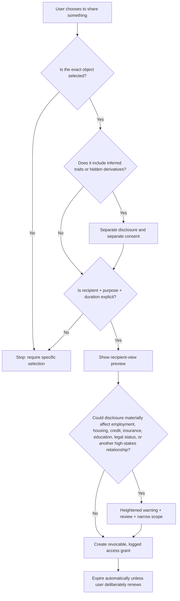

# HI-12 — FRICTION IS A SAFETY FEATURE

**Status:** Draft  
**Introduced:** 1.0.0-draft.1

**Rule:** The more intimate the information, the harder it should be to accidentally give it away.

Software culture has spent twenty years treating friction as a disease. Sometimes friction protects dignity.

Sharing three selected memories should not silently include thirty inferred traits. “Share with partner” should not mean permanent access to a continuously updating model. Consent should answer what is being shared, with whom, why, for how long, and what derived information is included. The FTC’s dark-pattern work is relevant here because privacy interfaces themselves can manipulate users toward disclosure. Student-privacy guidance in the United States similarly emphasizes that educational data shared with services must stay within authorized purposes rather than becoming reusable for unrelated ends. (U.S. Department of Education, current guidance).

**Implementation note:** Default to item-level sharing, expiring grants, separate consent for inferred traits, recipient previews, explicit purpose tags, downloadable access histories, and one-action revocation.

**Forbidden by HI-12:** “Share My Entire Cloud.”

---

This rule is reproduced from the complete [Human Index manuscript](../HUMAN-INDEX.md). Its wording, implementation note, forbidden example, and any embedded diagram should be read in the context of the full Index.
